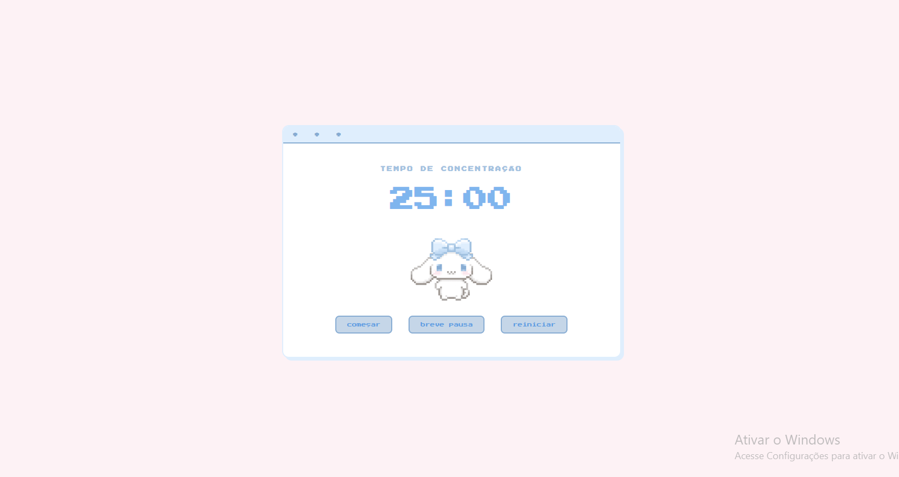
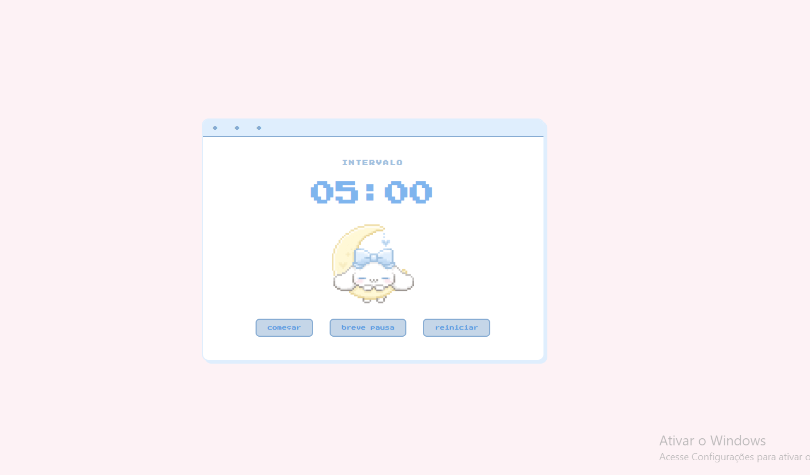

# 🍅 Pomodoro App

Um app de pomodoro fofo e pixel art com o Cinnamoroll! ˚ʚ♡ɞ˚




## ✨ Funcionalidades

- Timer de 25 minutos de foco
- Timer de 5 minutos de pausa
- Visual 8bit / pixel art
- Gif do Cinnamoroll que muda conforme o modo
- Botões de iniciar, pausar, resetar e forçar break

## Tecnologias

- HTML
- CSS
- JavaScript

## Como usar

1. Clone o repositório:
```bash
git clone https://github.com/LimaCarol/pomodoro.git
```

2. Abra o arquivo `index.html` com o Live Server no VSCode

3. Clique em **iniciar** e foque! 🎯

## 📁 Estrutura

```
pomodoro/
├── index.html
├── style.css
├── script.js
└── gifs/
    ├── foco.gif
    └── descanso.gif
```
